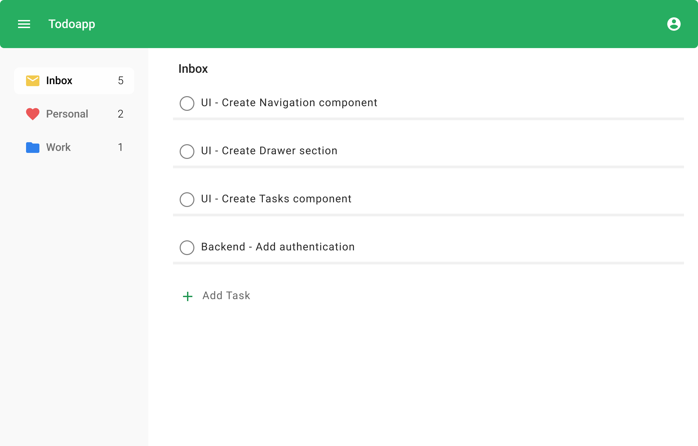

# Simple To-Do App

A simple to-do app built using React:

## Dev Status

- [X] Basic UI layout with styles
- [X] Delete task functionality
- [X] Create task functionality
- [ ] Edit task functionality
- [ ] Switch between Inbox, Personal and Work panes
- [ ] Authentication
- [ ] Backend API

## See it in action

https://todoapp-react-dirkjbreeuwer.vercel.app/

##  Features

- Ability to create, edit, and delete tasks
- Ability to sort tasks into different buckets for better organization

Preview the user-friendly interface of the TodoApp:



*Access Figma file for the UI [here](https://www.figma.com/file/DG89AKe3aFGtxJ1EZDoL8E/Simple-todo-app?node-id=0%3A1&t=yHNTPBedjpfBanr3-0)*

## Getting Started

1. Clone the repository

``` bash
git clone https://github.com/dirkjbreeuwer/todoapp-react
```

2. Install dependencies

``` bash
npm install
```

3. Start the development server

``` bash
npm start
```

## Built With

- React

## Author

[Dirk Breeuwer](https://github.com/dirkjbreeuwer)

## License

This project is licensed under the Apache 2.0 License.

